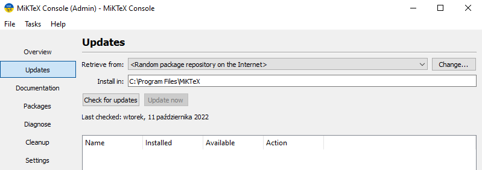

# Computer Science

General document on various **Computer Science** concepts. Typeset using **LaTeX** typesetting system.

## In case of problems with glossary compilation recipe

Change **MikTex** setting to allow unsafe output files:

```cmd
initexmf --admin --set-config-value=[Core]AllowUnsafeOutputFiles=t
```

Perform **MikTeX** update via **MikTeX Console App**



## References

* [LaTeX Workshop VS Code Extension Docs](https://github.com/James-Yu/LaTeX-Workshop/wiki)
* [GitHub Issue regarding: makeindex.exe: file not writable for security reasons](https://github.com/James-Yu/LaTeX-Workshop/issues/2416)
* [MikTeX Docs: miktex.ini section](https://docs.miktex.org/manual/miktex.ini.html)
* [MikTeX Docs: initexmf section](https://docs.miktex.org/manual/initexmf.html)
* [GitHub Issue regarding: bibtex8 could not handle _absolute_ windows paths](https://github.com/MiKTeX/miktex/issues/178)
